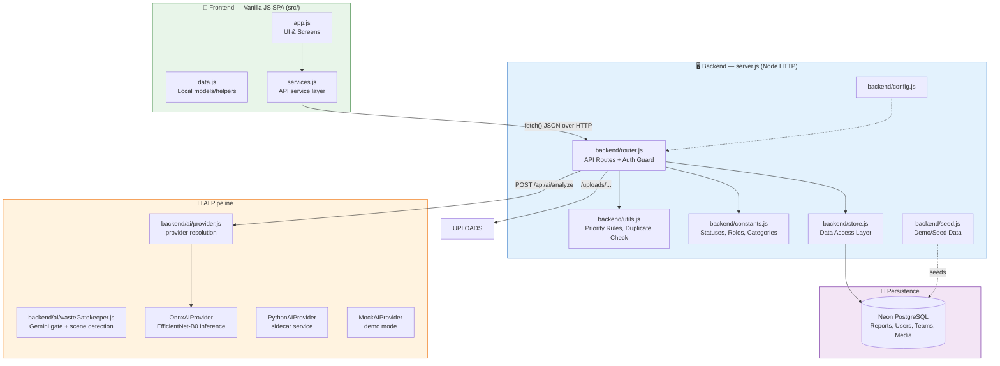
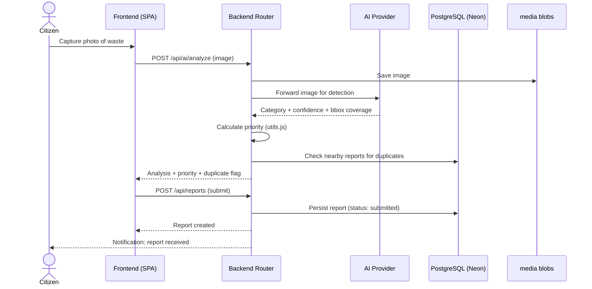
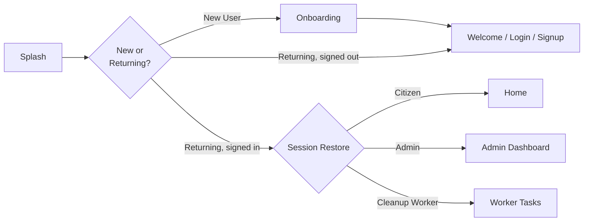
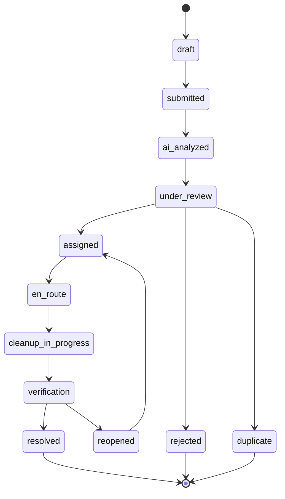
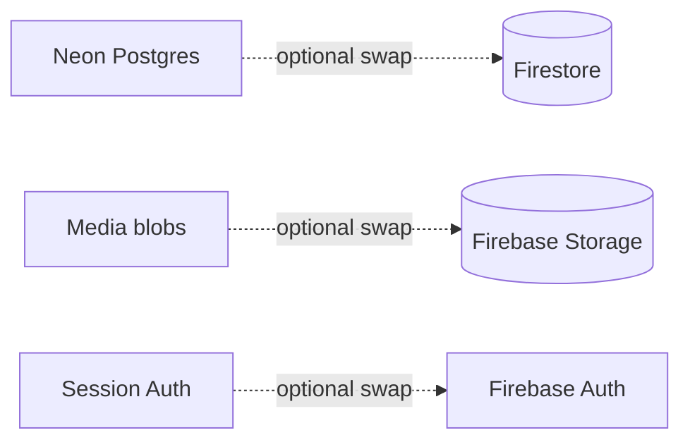

# 🧹 SwachhLens

**AI-Assisted Waste Reporting & Cleanup Coordination Platform**

SwachhLens lets citizens snap a photo of waste/garbage in their locality, uses an on-device **EfficientNet-B0 ONNX classifier** (90.8% test accuracy) guarded by a **Gemini vision gatekeeper** to classify and prioritize it, and routes the report through an admin/worker workflow — from submission all the way to verified cleanup.

<p align="center">
  
  
  
  
  
</p>

---

## 📑 Table of Contents

- [Overview](#-overview)
- [Screenshots](#-screenshots)
- [Features](#-features)
- [Architecture](#-architecture)
- [Tech Stack](#-tech-stack)
- [Folder Structure](#-folder-structure)
- [Getting Started](#-getting-started)
- [Environment Variables](#-environment-variables)
- [Demo Accounts](#-demo-accounts)
- [App Startup Flow](#-app-startup-flow)
- [Report Lifecycle](#-report-lifecycle)
- [API Reference](#-api-reference)
- [AI Pipeline](#-ai-pipeline)
- [Backend Swap Path](#-backend-swap-path)
- [Verification / Testing](#-verification--testing)
- [Roadmap](#-roadmap)
- [Contributing](#-contributing)
- [License](#-license)

---

## 🌍 Overview

**SwachhLens** is a full-stack, mobile-first web app built to make community waste reporting fast and accountable. A citizen captures an image of garbage/waste, the app runs it through an AI vision pipeline to detect the waste category and estimate volume, auto-calculates a priority score, checks for duplicate reports nearby, and pushes it into an admin review → team assignment → cleanup → verification pipeline — with real-time status notifications back to the reporter.

The project runs a lightweight custom Node.js backend (no framework) backed by **Neon serverless PostgreSQL**, deployed on **Vercel** (SPA + serverless functions + cron), with media blobs stored in the database and served via `/uploads/`.

---

## 📸 Screenshots

> Add your actual app screenshots/GIFs here for a stronger first impression. Suggested slots:

| Splash / Onboarding | Home / Report Capture | Admin Dashboard |
|---|---|---|
| `docs/screenshots/splash.png` | `docs/screenshots/home.png` | `docs/screenshots/admin.png` |

```md
<!-- Example embed once you add images to a docs/screenshots folder -->


```

---

## ✨ Features

- 📷 **AI-powered waste detection** — EfficientNet-B0 ONNX classifier (10 waste categories, 90.8% test accuracy, leakage-controlled eval) with per-class threshold calibration
- 🛡️ **Gemini vision gatekeeper** — rejects non-waste images (selfies, documents) before inference and detects scene hazards (drain blockage, overflowing bins, construction debris) that a CNN class label can't express
- 🧮 **Deterministic priority scoring** — computed from AI output + volume estimate, with hazard and recyclability routing
- 🔁 **Real duplicate detection** — 64-bit dHash perceptual hash + GPS/time/category coarse filter; confirmed duplicates merge instead of cluttering the queue
- ⏰ **SLA auto-escalation** — stale reports auto-escalate (12/24/48 h by severity) via cron + lazy in-app sweep
- 🚛 **Fleet-aware dispatch suggestions** — scores teams by ward fit, live workload, vehicle capability, specialization and proximity
- 🔐 **Persistent authentication** — Neon-backed sessions with expiry, rate-limited login, password policy
- 👥 **Role-based access control** — Citizen / Worker / Admin / Ward Officer / Supervisor / Super Admin, enforced server-side on every route
- 🗂️ **Full report lifecycle tracking** — from `draft` to `resolved` with controlled state transitions
- 🧑‍🤝‍🧑 **Team assignment workflow** for admins to dispatch cleanup crews
- 🔔 **Notifications** — in-app + Web Push (VAPID), real-time via SSE with authenticated event streams
- 🖼️ **Before/after image storage** — media blobs in Postgres, served through `/uploads/`
- 🔌 **Pluggable AI provider** — `onnx` (bundled model), `python` (sidecar service), `mock` for demos
- 📊 **Admin dashboard & analytics** — aggregate stats, priority queue, complaint drill-down
- 📱 **PWA** — installable, offline shell, camera/GPS integration

---

## 🏗️ Architecture



### Request Flow — Reporting a Waste Item



---

## 🧰 Tech Stack

| Layer | Technology |
|---|---|
| Frontend | React 19 + Vite SPA (mobile-first PWA), Leaflet maps, MUI |
| Backend | Node.js — plain `http` server, no framework, deployed as Vercel serverless functions |
| Data store | Neon serverless PostgreSQL |
| Media storage | Media blobs in Postgres, served via `/uploads/` |
| AI / Detection | EfficientNet-B0 ONNX classifier (bundled) + Gemini vision gatekeeper, pluggable provider pattern |
| Real-time | SSE event stream (authenticated) + Socket.IO bridge |
| Push | Web Push (VAPID) |
| Auth | Backend-issued session tokens with expiry, rate-limited login, role-based access control |
| Cron | Vercel Cron — daily SLA escalation sweep |

---

## 📂 Folder Structure

```text
backend/
  ai/
    provider.js            # Provider resolution (onnx ⇄ python ⇄ mock) + fail-safe default
    onnxProvider.js        # EfficientNet-B0 inference, severity rules, dHash summary
    wasteGatekeeper.js     # Gemini gate: rejects non-waste images, detects scenes
  config.js                # Server configuration
  constants.js             # Statuses, roles, waste categories
  db.js                    # Neon PostgreSQL pool
  router.js                # All API routes + role-based auth guards + rate limits
  seed.js                  # Demo/seed data (guarded; never runs in production)
  store.js                 # Data access layer (parameterized SQL)
  utils.js                 # Priority scoring, dHash perceptual hashing, helpers
src/                        # React SPA (pages/, components/, hooks/, services)
swachhlens-ai/
  checkpoints/              # best_classifier.onnx + metadata + thresholds
  training/                 # Training pipeline + manifest + eval report
api/index.js               # Vercel serverless entrypoint
server.js                  # Local Node HTTP server entrypoint
vercel.json                # Rewrites, headers, cron, function config
index.html
package.json
```

---

## 🚀 Getting Started

### Prerequisites
- Node.js **v18+**
- npm

### Installation

```bash
# 1. Clone the repository
git clone https://github.com/<your-username>/swachhlens.git
cd swachhlens

# 2. Install dependencies
npm install

# 3. Copy environment template
cp .env.example .env

# 4. Run the app
npm run dev
```

The app will be available at:

```
http://127.0.0.1:4173
```

---

## 🔑 Environment Variables

Set these in `.env` (see `.env.example`):

| Variable | Required | Description |
|---|---|---|
| `DATABASE_URL` | **Yes** | Neon PostgreSQL connection string |
| `AI_PROVIDER` | No (default: auto) | `onnx` (bundled model — recommended), `python` (sidecar), `mock` (demo). Unset/unknown values fall back to the bundled ONNX model when present, never silently to mock |
| `GEMINI_API_KEY` | Recommended | Enables the Gemini vision gatekeeper + scene detection + after-photo AI verification |
| `VAPID_PUBLIC_KEY` / `VAPID_PRIVATE_KEY` / `VAPID_SUBJECT` | For web push | VAPID keys (`npx web-push generate-vapid-keys`) |
| `VITE_VAPID_PUBLIC_KEY` | For web push | Same public key, exposed to the frontend |
| `CRON_SECRET` | For cron | Shared secret for `/api/cron/escalate` (Vercel Cron sends it as Bearer token) |
| `FRONTEND_URL` | Recommended | Allowed CORS origin |
| `INTERNAL_API_SECRET` | No | Shared secret for internal service calls |

> ⚠️ The browser only ever talks to this backend. Gemini/ONNX inference and all secrets stay server-side; the client only receives analysis results.

---

## 👤 Demo Accounts

| Role | Email | Password |
|---|---|---|
| Citizen | `citizen@swachhlens.app` | `citizen123` |
| Admin | `admin@swachhlens.com` | `admin@swachhlens.com` |
| Worker | `worker@swachhlens.app` | `worker123` |

> Normal sign-up always creates a **citizen** account. Admin and Worker roles are seeded / admin-provisioned only.

---

## 🧭 App Startup Flow



---

## 🔄 Report Lifecycle

Controlled centrally in `backend/constants.js`:



---

## 🔌 API Reference

| Method | Endpoint | Description |
|---|---|---|
| `GET` | `/api/health` | Health check |
| `GET` | `/api/app/bootstrap` | Initial app config/session bootstrap |
| `POST` | `/api/auth/signup` | Register a new citizen |
| `POST` | `/api/auth/login` | Log in, returns session token |
| `POST` | `/api/auth/logout` | Invalidate session |
| `POST` | `/api/auth/reset-password` | Password reset |
| `GET` | `/api/reports` | List reports |
| `POST` | `/api/reports` | Create a new report |
| `GET` | `/api/reports/:id` | Get a single report |
| `PATCH` | `/api/reports/:id/status` | Update report status |
| `POST` | `/api/teams/assign` | Assign a cleanup team to a report |
| `GET` | `/api/teams` | List teams |
| `GET` | `/api/notifications` | Get notifications for current user |
| `GET` | `/api/admin/dashboard` | Aggregate stats for admin dashboard |
| `POST` | `/api/ai/analyze` | Run AI analysis on an uploaded image |

---

## 🤖 AI Pipeline

- Frontend calls `POST /api/ai/analyze` with the captured image.
- **Gatekeeper first**: with `GEMINI_API_KEY` set, a Gemini vision call rejects non-waste images (returns a friendly "this doesn't look like waste" verdict) and classifies the scene (`drain_blockage`, `overflowing_bin`, `construction_debris`) so hazards that a CNN class label can't express still route correctly. Results are cached per image hash.
- **Classifier**: the bundled EfficientNet-B0 ONNX model (16 MB, runs in-process via `onnxruntime-node`) predicts across 10 waste categories with per-class calibrated thresholds; low-confidence predictions fall back to a heuristic detector rather than guessing.
- **Output**: waste type, confidence, estimated volume, severity, hazard/recyclability flags, recommended action, dispatch suggestion, and a 64-bit dHash perceptual hash.
- **Duplicate detection** at submission time: coarse filter (48 h window, GPS ≤ 700 m, same category) then dHash Hamming distance ≤ 10 ⇒ confirmed duplicate, merged into the original report's group. Without a visual match, reports are only softly linked by geo/time/category — never falsely merged.
- **After-photo verification**: on worker completion, Gemini compares before/after images and stores an AI verification verdict for admin review.
- Priority scoring itself is deterministic and rule-based, implemented in `backend/utils.js`.
- Demo mode: set `AI_PROVIDER=mock` for structured, deterministic analysis without any model or API key.

### Model evaluation (held-out test set, 3,035 images)

| Metric | Score |
|---|---|
| Top-1 accuracy | 90.84% |
| Macro F1 | 88.58% |

Trained on 20,248 images (Garbage Classification + RealWaste) with a leakage-controlled 70/15/15 split; see `swachhlens-ai/checkpoints/eval_report.json`.

---

## 🔥 Backend Swap Path

The app already runs on managed infrastructure (**Neon Postgres + Vercel**). The frontend service layer (`src/services.js`) is the only integration point, so the backend can be swapped underneath without UI changes.



**Planned steps:**

1. Add Firebase client SDK for frontend auth.
2. Add Firebase Admin credentials securely on the server.
3. Replace Postgres persistence with Firestore reads/writes.
4. Replace media blob storage with Firebase Storage.
5. Keep the existing frontend service interface (`src/services.js`) and swap backend providers underneath — no UI rewrite needed.

---

## ✅ Verification / Testing

Last verified: **August 23, 2026** — production deploy on Vercel with live ONNX inference, Gemini gatekeeper, authenticated SSE, rate limiting, dHash duplicate merging, and cron-secured escalation endpoint.

```bash
node --check server.js
node --check backend/router.js
node --check backend/ai/provider.js
node --check backend/ai/onnxProvider.js

# Model smoke test (runs the bundled ONNX classifier against test images)
node scripts/test_onnx_provider.mjs
```

**API smoke test:**
```
GET  /api/health
GET  /api/app/bootstrap
POST /api/auth/login        # 429 after repeated failures (rate limited)
POST /api/ai/analyze        # real inference + phash + gatekeeper verdict
POST /api/reports           # persists flags/detectionSummary, runs dedup
```

---

## 🗺️ Roadmap

- [x] Real trained model in production (EfficientNet-B0 ONNX, 90.84% accuracy)
- [x] Push notifications (Web Push / VAPID)
- [ ] Firebase Auth + Firestore + Storage migration (optional swap)
- [ ] Map-based report clustering
- [ ] Worker mobile PWA optimizations
- [ ] Automated CI checks (lint + `node --check` + smoke tests)

---

## 🤝 Contributing

Contributions are welcome!

1. Fork the repo
2. Create a feature branch: `git checkout -b feature/your-feature`
3. Commit your changes: `git commit -m "Add: your feature"`
4. Push and open a Pull Request

Please keep business logic out of UI files — the backend router/store/utils split exists specifically to keep this app hackathon-friendly and easy to extend.

---

## 📄 License

This project is licensed under the **MIT License** — see the [LICENSE](LICENSE) file for details.

---

<p align="center">Made with ❤️ for cleaner neighborhoods — <b>SwachhLens</b></p>
