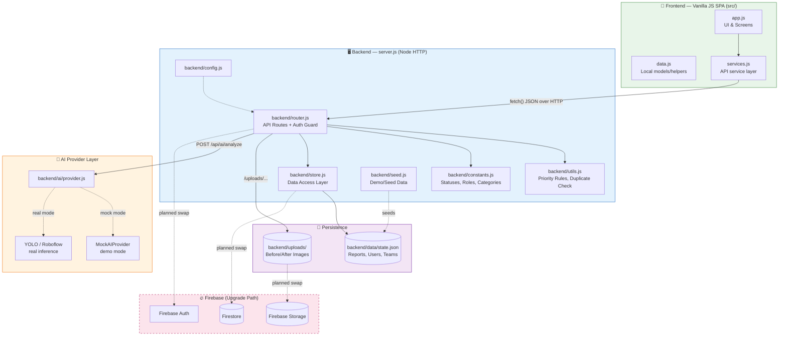
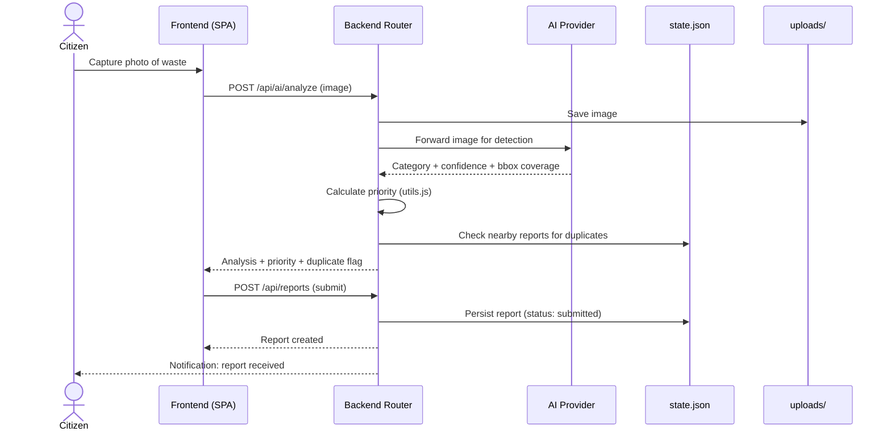
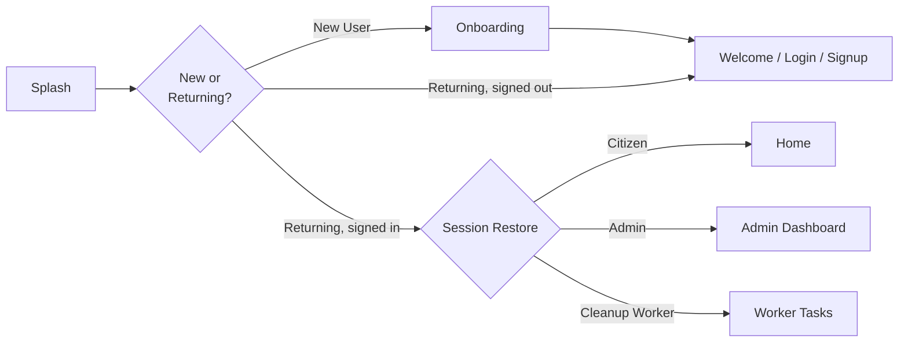
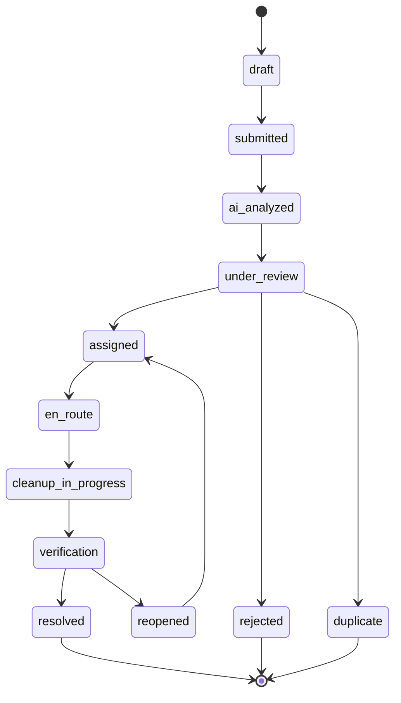
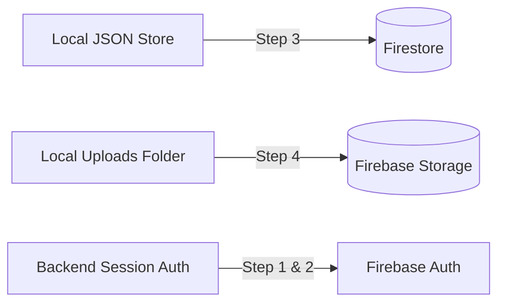

# 🧹 SwachhLens

**AI-Assisted Waste Reporting & Cleanup Coordination Platform**

SwachhLens lets citizens snap a photo of waste/garbage in their locality, uses AI (YOLO-based object detection) to classify and prioritize it, and routes the report through an admin/worker workflow — from submission all the way to verified cleanup.

<p align="center">
  
  
  
  
  
</p>

---

## 📑 Table of Contents

- [Overview](#-overview)
- [Screenshots](#-screenshots)
- [Features](#-features)
- [Architecture](#-architecture)
- [Tech Stack](#-tech-stack)
- [Folder Structure](#-folder-structure)
- [Getting Started](#-getting-started)
- [Environment Variables](#-environment-variables)
- [Demo Accounts](#-demo-accounts)
- [App Startup Flow](#-app-startup-flow)
- [Report Lifecycle](#-report-lifecycle)
- [API Reference](#-api-reference)
- [AI / YOLO Integration](#-ai--yolo-integration)
- [Firebase Upgrade Path](#-firebase-upgrade-path)
- [Verification / Testing](#-verification--testing)
- [Roadmap](#-roadmap)
- [Contributing](#-contributing)
- [License](#-license)

---

## 🌍 Overview

**SwachhLens** is a full-stack, mobile-first web app built to make community waste reporting fast and accountable. A citizen captures an image of garbage/waste, the app runs it through an AI vision pipeline to detect the waste category and estimate volume, auto-calculates a priority score, checks for duplicate reports nearby, and pushes it into an admin review → team assignment → cleanup → verification pipeline — with real-time status notifications back to the reporter.

The project currently ships with a lightweight custom Node.js backend (no framework) backed by a local JSON data store and local file-based media storage, structured so it can be swapped for **Firebase (Auth + Firestore + Storage)** with minimal frontend changes.

---

## 📸 Screenshots

> Add your actual app screenshots/GIFs here for a stronger first impression. Suggested slots:

| Splash / Onboarding | Home / Report Capture | Admin Dashboard |
|---|---|---|
| `docs/screenshots/splash.png` | `docs/screenshots/home.png` | `docs/screenshots/admin.png` |

```md
<!-- Example embed once you add images to a docs/screenshots folder -->


```

---

## ✨ Features

- 📷 **AI-powered waste detection** — image classified into 8 waste categories via YOLO
- 🧮 **Deterministic priority scoring** — computed from AI output + volume estimate
- 🔁 **Duplicate detection** — nearby recent reports + category matching
- 🔐 **Persistent authentication** — backend-issued session tokens, no more mock/browser-only auth
- 👥 **Role-based access control** — Citizen / Admin / Cleanup Worker, enforced server-side
- 🗂️ **Full report lifecycle tracking** — from `draft` to `resolved` with 12 controlled states
- 🧑‍🤝‍🧑 **Team assignment workflow** for admins to dispatch cleanup crews
- 🔔 **Notifications** for status changes on a citizen's reports
- 🖼️ **Before/after image storage** — local storage now, Firebase Storage-ready
- 🔌 **Pluggable AI provider** — `MockAIProvider` for demos, swap in a real YOLO/Roboflow endpoint via env vars
- 📊 **Admin dashboard** with aggregate stats

---

## 🏗️ Architecture



### Request Flow — Reporting a Waste Item



---

## 🧰 Tech Stack

| Layer | Technology |
|---|---|
| Frontend | Vanilla JavaScript SPA (mobile-first) |
| Backend | Node.js — plain `http` server, no framework |
| Data store | JSON file-based store (`backend/data/state.json`) |
| Media storage | Local filesystem (`backend/uploads/`) — Firebase Storage stand-in |
| AI / Detection | YOLO via Roboflow-hosted (or compatible) endpoint, pluggable provider pattern |
| Auth | Backend-issued session tokens, role-based access control |
| Planned upgrade | Firebase Auth · Firestore · Firebase Storage |

---

## 📂 Folder Structure

```text
backend/
  ai/
    provider.js       # AI provider abstraction (mock ⇄ real YOLO)
  config.js            # Server configuration
  constants.js         # Statuses, roles, waste categories
  data/
    state.json         # Persistent local data store
  router.js             # All API routes + role-based auth guards
  seed.js               # Demo/seed data (users, sample reports)
  store.js              # Data access layer over state.json
  utils.js               # Priority scoring, duplicate detection
  uploads/               # Uploaded before/after images
src/
  app.js                 # UI screens & app logic
  data.js                 # Client-side data models/helpers
  services.js              # API service layer (fetch wrappers)
index.html
server.js                  # Node HTTP server entrypoint
.env.example
package.json
```

---

## 🚀 Getting Started

### Prerequisites
- Node.js **v18+**
- npm

### Installation

```bash
# 1. Clone the repository
git clone https://github.com/<your-username>/swachhlens.git
cd swachhlens

# 2. Install dependencies
npm install

# 3. Copy environment template
cp .env.example .env

# 4. Run the app
npm run dev
```

The app will be available at:

```
http://127.0.0.1:4173
```

---

## 🔑 Environment Variables

Set these in `.env` (see `.env.example`):

| Variable | Required | Description |
|---|---|---|
| `AI_PROVIDER` | No (default: `mock`) | `mock` for demo mode, `real` to hit a live YOLO endpoint |
| `YOLO_ENDPOINT_URL` | Only if `AI_PROVIDER=real` | Roboflow-hosted or compatible inference endpoint |
| `YOLO_API_KEY` | Only if `AI_PROVIDER=real` | Server-side only — **never expose in frontend code** |
| `YOLO_TIMEOUT_MS` | No (default: `15000`) | Request timeout for the inference call |

> ⚠️ The browser only ever talks to this backend. The backend forwards image data to YOLO server-side, so the API key is never exposed to the client.

---

## 👤 Demo Accounts

| Role | Email | Password |
|---|---|---|
| Citizen | `citizen@swachhlens.app` | `citizen123` |
| Admin | `admin@swachhlens.demo` | `admin@809` |
| Worker | `worker@swachhlens.app` | `worker123` |

> Normal sign-up always creates a **citizen** account. Admin and Worker roles are seeded / admin-provisioned only.

---

## 🧭 App Startup Flow



---

## 🔄 Report Lifecycle

Controlled centrally in `backend/constants.js`:



---

## 🔌 API Reference

| Method | Endpoint | Description |
|---|---|---|
| `GET` | `/api/health` | Health check |
| `GET` | `/api/app/bootstrap` | Initial app config/session bootstrap |
| `POST` | `/api/auth/signup` | Register a new citizen |
| `POST` | `/api/auth/login` | Log in, returns session token |
| `POST` | `/api/auth/logout` | Invalidate session |
| `POST` | `/api/auth/reset-password` | Password reset |
| `GET` | `/api/reports` | List reports |
| `POST` | `/api/reports` | Create a new report |
| `GET` | `/api/reports/:id` | Get a single report |
| `PATCH` | `/api/reports/:id/status` | Update report status |
| `POST` | `/api/teams/assign` | Assign a cleanup team to a report |
| `GET` | `/api/teams` | List teams |
| `GET` | `/api/notifications` | Get notifications for current user |
| `GET` | `/api/admin/dashboard` | Aggregate stats for admin dashboard |
| `POST` | `/api/ai/analyze` | Run AI analysis on an uploaded image |

---

## 🤖 AI / YOLO Integration

- Frontend calls `POST /api/ai/analyze` with the captured image.
- Backend resolves the active provider (`backend/ai/provider.js`).
- In demo mode, `MockAIProvider` returns structured, deterministic waste analysis — no external calls, no API key needed.
- To go live, point the backend at a real YOLO/Roboflow model:

```bash
AI_PROVIDER=real
YOLO_ENDPOINT_URL=https://serverless.roboflow.com/your-model/1
YOLO_API_KEY=your_server_side_key
YOLO_TIMEOUT_MS=15000
```

- The backend maps returned labels to the **8 SwachhLens waste categories**, estimates volume from combined bounding-box coverage, and computes a recommended priority/response.
- Priority scoring itself is deterministic and rule-based, implemented in `backend/utils.js`.
- Duplicate detection cross-references nearby recent reports plus category match.

---

## 🔥 Firebase Upgrade Path

The project is structurally **Firebase-ready** but currently runs fully in mock/local mode (no Firebase SDK or secrets present yet).



**Planned steps:**

1. Add Firebase client SDK for frontend auth.
2. Add Firebase Admin credentials securely on the server.
3. Replace local JSON persistence with Firestore reads/writes.
4. Replace local upload storage with Firebase Storage.
5. Keep the existing frontend service interface (`src/services.js`) and swap backend providers underneath — no UI rewrite needed.

---

## ✅ Verification / Testing

Last verified: **August 7, 2026**

```bash
node --check server.js
node --check backend/router.js
node --check backend/ai/provider.js
node --check src/services.js
```

**API smoke test:**
```
GET  /api/health
GET  /api/app/bootstrap
POST /api/auth/login
GET  /api/reports
```

---

## 🗺️ Roadmap

- [ ] Firebase Auth + Firestore + Storage migration
- [ ] Real YOLO/Roboflow model integration (production)
- [ ] Push notifications (FCM)
- [ ] Map-based report clustering
- [ ] Worker mobile PWA optimizations
- [ ] Automated CI checks (lint + `node --check` + smoke tests)

---

## 🤝 Contributing

Contributions are welcome!

1. Fork the repo
2. Create a feature branch: `git checkout -b feature/your-feature`
3. Commit your changes: `git commit -m "Add: your feature"`
4. Push and open a Pull Request

Please keep business logic out of UI files — the backend router/store/utils split exists specifically to keep this app hackathon-friendly and easy to extend.

---

## 📄 License

This project is licensed under the **MIT License** — see the [LICENSE](LICENSE) file for details.

---

<p align="center">Made with ❤️ for cleaner neighborhoods — <b>SwachhLens</b></p>
